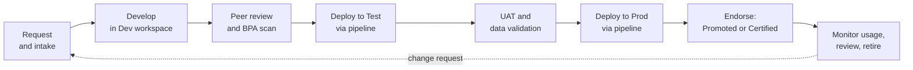

# powerbi-governance-framework

A practical, opinionated governance framework for **Power BI on Microsoft Fabric**: how content is organized, developed, promoted, secured, certified, and retired. It is designed for a healthcare operator replacing ad hoc reporting with a governed platform, but the patterns apply to any regulated environment.

The goal is not more process. The goal is **fewer, better reports that people trust**, with clear ownership and a short path from idea to certified content.

All examples are generic. No PHI and no employer data or configuration appear in this repository. The reference model uses data from [synthetic-snf-data-generator](https://github.com/shaunazamarripa-svg/synthetic-snf-data-generator), landed through the [fabric-lakehouse-blueprint](https://github.com/shaunazamarripa-svg/fabric-lakehouse-blueprint).

## Content lifecycle

## What is in the framework

| Document | Question it answers |
|---|---|
| [Workspace and environment standards](docs/workspace-and-environment-standards.md) | Where does content live, and who can do what? |
| [Deployment pipeline workflow](docs/deployment-pipeline-workflow.md) | How does a change get from a developer to production safely? |
| [Modeling and naming standards](docs/modeling-and-naming-standards.md) | What does a well-built semantic model look like? |
| [Row-level security standards](docs/rls-standards.md) | How do we restrict data by facility or region without creating a maintenance burden? |
| [Certification checklist](docs/certification-checklist.md) | What must be true before content earns a Certified badge? |
| [Release checklist template](templates/release-checklist.md) | A one-page gate for every production release |
| [Best-practice rules (Tabular Editor)](tabular-editor/BestPracticeRules.json) | Automated checks that enforce the modeling standards |

## Principles

1. **One definition, one owner.** Metrics are defined once in a certified semantic model. Reports consume them; they do not redefine them.
2. **Production is deployed to, never edited.** Every change goes through Dev, Test, and Prod.
3. **Tiered trust.** Not everything needs to be certified. Personal and team content is fine, as long as it is clearly labeled as such.
4. **Security by design.** Access is granted through groups, data is restricted with row-level security in the model, and sensitive items carry sensitivity labels.
5. **Automate the boring checks.** Naming, formatting, and modeling rules run as a scan, so human review time goes to logic and definitions.
6. **Maintainable by someone else.** If a report only makes sense to its author, it is not finished.

## Roles

| Role | Responsibilities |
|---|---|
| Data owner (business) | Approves metric definitions and who may see what data |
| Semantic model owner | Builds and maintains the certified model, owns refresh and quality |
| Report author | Builds reports on certified models; does not create competing definitions |
| Platform team | Capacity, workspaces, pipelines, tenant settings, monitoring |
| Governance lead | Runs certification, reviews exceptions, owns this framework |

## Adopting it: 30-60-90

| Window | Focus |
|---|---|
| First 30 days | Inventory content and usage; agree on workspace layout and naming; identify the 5 to 10 reports that drive decisions |
| Days 31 to 60 | Stand up Dev/Test/Prod for one domain; build its certified semantic model; add RLS and sensitivity labels |
| Days 61 to 90 | Certify the first models; retire duplicates; publish the intake process; start a monthly usage and quality review |

## Licensing and capacity notes

Deployment pipelines and Fabric features such as Direct Lake require workspaces on a Fabric-enabled or Premium capacity. Viewer licensing depends on capacity size and your agreement with Microsoft. Confirm these against current Microsoft documentation and your own tenant before committing to a design.

## Status

These are working standards intended to be adapted, not a compliance certification. The Best Practice Analyzer rule file is valid JSON, but load it into Tabular Editor and run it against a real model before relying on it. Validate the rules against your own tenant settings, regulatory requirements, and legal or compliance review.

## License

MIT. See [LICENSE](LICENSE).
